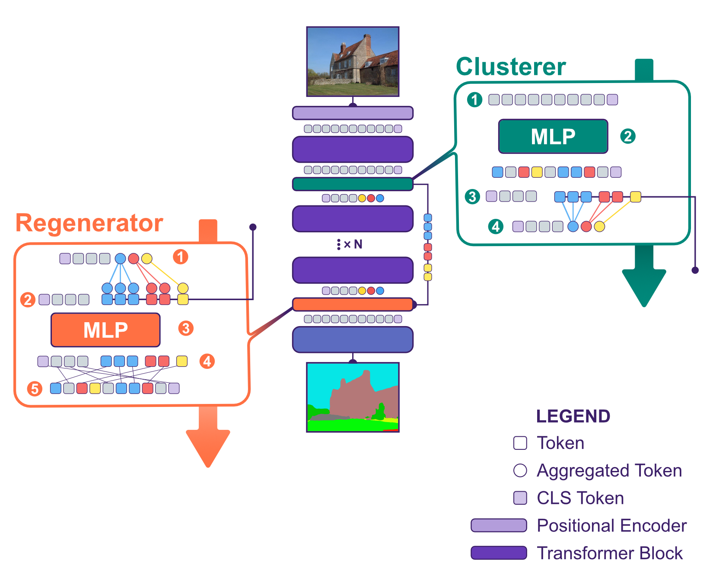

# ClustViT: Clustering-based Token Merging for Semantic Segmentation

[](https://arxiv.org/abs/2510.01948)
[](https://2026.ieee-icra.org/)
[](LICENSE)

**Fabio Montello, Ronja Güldenring, Lazaros Nalpantidis**  
Department of Electrical and Photonics Engineering, DTU – Technical University of Denmark  
`{fabmo, ronjag, lanalpa}@dtu.dk`

> *Accepted at IEEE International Conference on Robotics and Automation (ICRA) 2026*

---

## Overview

<p align="center">
  
</p>

Vision Transformers (ViTs) achieve strong performance in semantic segmentation but suffer from quadratic attention complexity, limiting deployment on real-world robotic systems. **ClustViT** addresses this by introducing a semantically guided token merging strategy tailored specifically to dense prediction.

At its core, ClustViT integrates two novel components into the ViT backbone:

- **Cluster module** — an end-to-end trainable MLP that assigns tokens to semantic clusters derived from segmentation mask pseudo-labels, then merges each cluster into a single representative token. This reduces sequence length—and thus attention cost—for all subsequent Transformer layers.
- **Regenerator module** — reconstructs full-resolution token representations from the compressed sequence before passing them to off-the-shelf segmentation heads (Segmenter, UPerNet), preserving compatibility with any standard decoder.

The approach achieves up to **2.18× fewer GFLOPs** and **1.64× faster inference** across three datasets (ADE20K, SUIM, RumexWeeds), with only modest accuracy trade-offs. Gains are most pronounced on robotic datasets dominated by background regions (agricultural, underwater), where semantic uniformity enables aggressive token compression.

---


## Installation

ClustViT is built on top of [mmsegmentation](https://github.com/open-mmlab/mmsegmentation). We recommend a Python 3.9+ environment with CUDA 11.8 or later.

**1. Clone the repository**
```bash
git clone https://github.com/DTU-PAS/clustvit.git
cd clustvit
```

**2. Install dependencies and fix mmseg**
```bash
conda create -n clustvit_env python=3.10 -y
conda activate clustvit_env
pip install -r requirements.txt
python3 tools/patch_mmseg.py 
```


---

## Dataset Preparation

### ADE20K
Download from the [official site](http://data.csail.mit.edu/places/ADEchallenge/ADEChallengeData2016.zip) and place it under `data/ade/`. The expected structure is:

```
data/ade/ADEChallengeData2016/
    images/
        training/
        validation/
    annotations/
        training/
        validation/
```

### SUIM
Download from the [SUIM project page](http://irvlab.cs.umn.edu/resources/suim-dataset). After downloading, convert the RGB masks to single-channel label masks:

```bash
python tools/suim_mask_convert.py /path/to/suim_root
```

The expected structure after conversion is:
```
data/suim/
    train_val/
        images/
        masks_label/
    test/
        images/
        masks_label/
```

### RumexWeeds
Download from [the RumexWeeds repository](https://github.com/DTU-R3/RumexWeeds). After downloading, run the preparation script:

```bash
python tools/rumexweeds_prepare.py /path/to/rumexweeds_root
```

---

## Training

Training uses a standard mmsegmentation runner. The `train.py` script accepts a config file and optional overrides.

**General usage**
```bash
python train.py <config> [--work-dir <dir>] [--amp] [--resume]
```

**Example: ClustViT-b, k=3, ip=3 with Segmenter head on ADE20K**
```bash
python train.py \
    config/clustvit/ade20k/segmenter_clustvit-b_mask_1xb8-160k_ade20k-512x512_k3_ip3.py \
    --work-dir logs/clustvit_b_k3_ip3_ade20k
```

**Example: ClustViT-b, k=3, ip=3 with Segmenter head on SUIM**
```bash
python train.py \
    config/clustvit/others/segmenter_clustvit-b_mask_1xb8-80k_suim-512x512_k3_ip3.py \
    --work-dir logs/clustvit_b_k3_ip3_suim
```

**Mixed precision training**
```bash
python train.py <config> --amp
```

**Resume from checkpoint**
```bash
python train.py <config> --resume --work-dir <previous_work_dir>
```

### Config naming convention

Configs follow the pattern:
```
{head}_{backbone}_{schedule}_{dataset}_{resolution}_k{clusters}_ip{injection_point}
```

For example, `segmenter_clustvit-b_mask_1xb8-160k_ade20k-512x512_k3_ip3` trains a base ClustViT with the Segmenter head, merging up to `k=3` clusters, with the Cluster module injected after Transformer block `ip=3`.

---

## Evaluation

```bash
python test.py <config> <checkpoint> [--work-dir <dir>] [--show-dir <dir>]
```

**Example**
```bash
python test.py \
    config/clustvit/ade20k/segmenter_clustvit-b_mask_1xb8-160k_ade20k-512x512_k3_ip3.py \
    logs/clustvit_b_k3_ip3_ade20k/iter_160000.pth \
    --work-dir logs/clustvit_b_k3_ip3_ade20k/eval
```

To save prediction visualizations, pass `--show-dir`:
```bash
python test.py <config> <checkpoint> --show-dir vis/
```

---

## Benchmarking

### Inference speed (img/s)
```bash
python tools/get_fps.py <config> <checkpoint> [--repeat-times <N>] [--work-dir <dir>]
```

### GFLOPs
```bash
python tools/get_flops.py <config> [--shape <H> <W>]
```

### Token count distribution
```bash
python tools/count_tokens.py <config> <checkpoint>
```

### Cluster assignment analysis
```bash
python tools/clust_analysis.py <config> <checkpoint>
```

Benchmarks for the paper were measured on an Intel i9-14900KF CPU, 96 GB RAM, and an NVIDIA RTX 4090 GPU (24 GB VRAM). Training was performed on a single NVIDIA H100 GPU (80 GB VRAM).

---

## Pretrained Weights

Pretrained ImageNet weights (ViT, 384×384, patch size 16) are loaded automatically from mmsegmentation when training from scratch. Fine-tuned ClustViT checkpoints will be released upon publication.

| Config | Dataset | Head | mIoU | Download | Config |
|--------|---------|------|------|----------| ------- | 
| ClustViT-b k3,ip3 | ADE20K | Segmenter | 46.10 | *coming soon* |  *coming soon* |
| ClustViT-b k3,ip3 | SUIM | Segmenter | 61.95 | *coming soon* | *coming soon* |
| ClustViT-b k3,ip3 | RumexWeeds | Segmenter | 49.82 | *coming soon* | *coming soon* |
| ClustViT-b k3,ip3 | ADE20K | UPerNet | 44.70 | *coming soon* | *coming soon* |
| ClustViT-b k3,ip3 | SUIM | UPerNet | 63.77 | *coming soon* | *coming soon* |
| ClustViT-b k3,ip3 | RumexWeeds | UPerNet | 50.55 | *coming soon* | *coming soon* |

---

## Results

All results use single-scale inference. GFLOPs include standard deviation to reflect the variable compression rate across images.

### ADE20K

| Head       | Backbone            | mIoU ↑ | img/s ↑ | GFLOPs ↓          |
|------------|---------------------|--------|---------|-------------------|
| Segmenter  | ViT-b               | 49.22  | 36.06   | 473.15 ± 99.30    |
| Segmenter  | CTS-b               | 45.96  | 44.62   | 347.11 ± 72.85    |
| Segmenter  | ClustViT-b k3,ip3   | 46.10  | 47.56   | 321.28 ± 88.83    |
| Segmenter  | ClustViT-b k1,ip4   | 48.20  | 41.66   | 399.13 ± 99.86    |
| UPerNet    | ViT-b               | 47.53  | 33.63   | 637.51 ± 72.85    |
| UPerNet    | CTS-b               | 46.85  | 41.55   | 511.48 ± 107.35   |
| UPerNet    | ClustViT-b k3,ip3   | 44.70  | 42.65   | 494.67 ± 119.59   |

### SUIM

| Head       | Backbone            | mIoU ↑ | img/s ↑ | GFLOPs ↓          |
|------------|---------------------|--------|---------|-------------------|
| Segmenter  | ViT-b               | 69.91  | 70.80   | 252.33 ± 0.00     |
| Segmenter  | CTS-b               | 66.33  | 85.41   | 183.40 ± 0.00     |
| Segmenter  | ClustViT-b k4,ip4   | 63.86  | 116.56  | 132.94 ± 8.95     |
| UPerNet    | ViT-b               | 70.01  | 64.90   | 384.24 ± 0.00     |
| UPerNet    | CTS-b               | 68.05  | 78.31   | 279.35 ± 0.00     |
| UPerNet    | ClustViT-b k2,ip4   | 65.02  | 103.54  | 224.51 ± 16.06    |

### RumexWeeds

| Head       | Backbone            | mIoU ↑ | img/s ↑ | GFLOPs ↓          |
|------------|---------------------|--------|---------|-------------------|
| Segmenter  | ViT-b               | 51.29  | 74.10   | 252.07 ± 0.00     |
| Segmenter  | CTS-b               | 48.54  | 92.32   | 183.18 ± 0.00     |
| Segmenter  | ClustViT-b k3,ip4   | 51.53  | 107.34  | 135.54 ± 37.98    |
| UPerNet    | ViT-b               | 51.56  | 68.61   | 348.23 ± 0.00     |
| UPerNet    | CTS-b               | 49.13  | 83.76   | 279.34 ± 0.00     |
| UPerNet    | ClustViT-b k3,ip3   | 50.55  | 100.18  | 221.14 ± 34.20    |

### Scaling across backbone sizes (Segmenter head, ADE20K)

| Backbone         | mIoU ↑ | img/s ↑ | GFLOPs ↓           |
|------------------|--------|---------|-------------------|
| ViT-t            | 38.62  | 96.55   | 46.27 ± 9.71      |
| ClustViT-t k3,ip4| 36.40  | 91.39   | 31.13 ± 8.13      |
| ViT-s            | 45.58  | 66.66   | 140.55 ± 29.50    |
| ClustViT-s k3,ip4| 42.76  | 75.01   | 96.26 ± 25.19     |
| ViT-l            | 51.45  | 8.48    | 2455.02 ± 514.21  |
| ClustViT-l k3,ip4| 49.93  | 15.58   | 1363.08 ± 444.40  |

---

## Repository Structure

```
.
├── config/                         # mmsegmentation configuration files
│   ├── _base_/                     # shared dataset, schedule, and model configs
│   ├── clustvit/                   # ClustViT experiment configs
│   │   ├── ade20k/                 # ADE20K experiments (k and ip ablations, model sizes)
│   │   └── others/                 # SUIM and RumexWeeds experiments
│   ├── cts/                        # CTS baseline configs
│   └── vit/                        # Vanilla ViT baseline configs
├── dynseg/                         # Main package
│   ├── clustvit.py                 # ClustViT backbone (Cluster + Regenerator modules)
│   ├── dynseg_encoder_decoder.py   # Encoder-decoder wrapper
│   ├── cts/                        # CTS baseline implementation
│   ├── datasets/                   # SUIM and RumexWeeds dataset classes
│   ├── loss/                       # Combined segmentation + clustering loss
│   ├── metrics.py                  # Evaluation metrics
│   └── utils.py                    # Shared utilities
├── tools/
│   ├── get_fps.py                  # Inference throughput benchmark
│   ├── get_flops.py                # GFLOPs calculation
│   ├── count_tokens.py             # Token count statistics
│   ├── clust_analysis.py           # Cluster assignment visualisation
│   ├── show_intermediate_features.py
│   ├── suim_mask_convert.py        # SUIM RGB→label mask conversion
│   ├── rumexweeds_prepare.py       # RumexWeeds dataset preparation
│   └── split_weights.py            # Checkpoint utility
├── weights/
│   └── policynet.pth               # CTS policy network weights
├── train.py
└── test.py
```

---

## Citation

If you use ClustViT in your research, please cite:

```bibtex
@article{montello2025clustvit,
  title     = {{ClustViT}: Clustering-based Token Merging for Semantic Segmentation},
  author    = {Montello, Fabio and G{\"u}ldenring, Ronja and Nalpantidis, Lazaros},
  booktitle = {2026 IEEE International Conference on Robotics and Automation (ICRA)}, 
  year      = {2026}
}
```

---

## Acknowledgements

This work was supported by Innovation Fund Denmark through the project *Safety and Autonomy for Vehicles in Agriculture (SAVA)*, grant 2105-00013A.

The codebase builds upon [mmsegmentation](https://github.com/open-mmlab/mmsegmentation). We thank the authors of [CTS](https://github.com/tue-mps/cts-segmenter), [Segmenter](https://github.com/rstrudel/segmenter), and [UPerNet](https://github.com/CSAILVision/unifiedparsing) for their publicly available implementations.

---

## License

This project is released under the [Apache 2.0 License](LICENSE).
